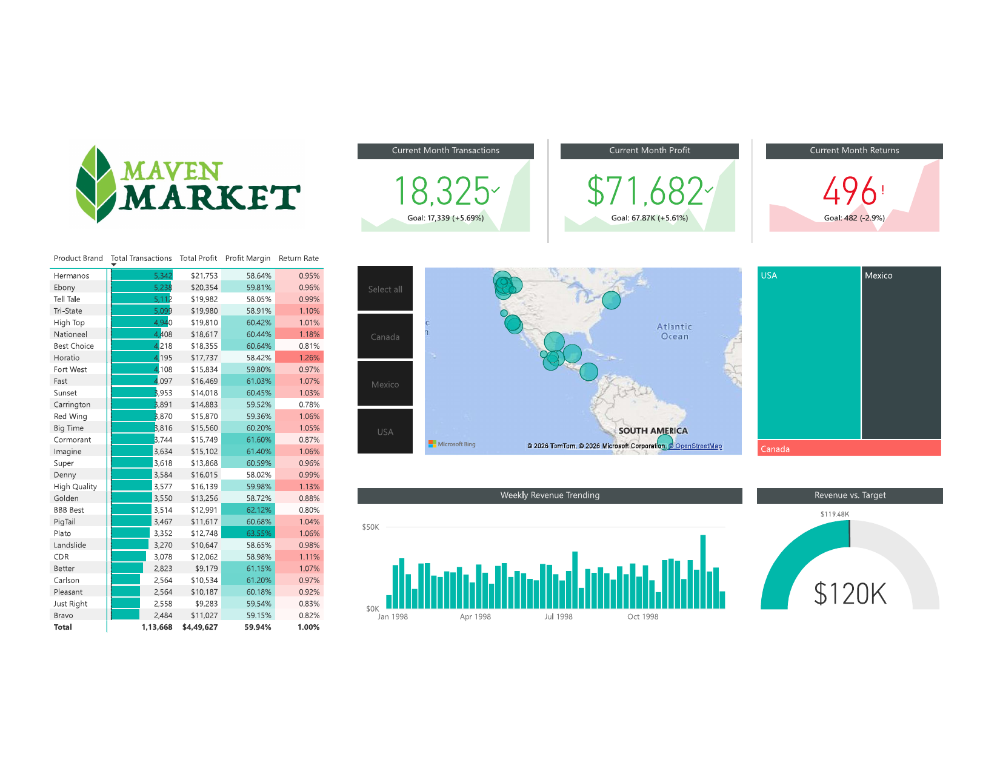
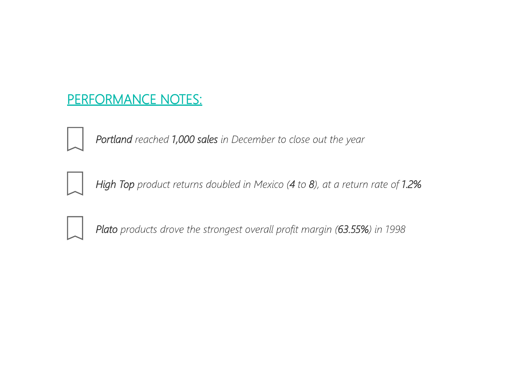

# Maven Market Sales Dashboard (Power BI)

A one-page executive sales dashboard built on Maven Analytics' public **Maven Market** sample dataset (a fictional grocery retailer operating across the US, Canada, and Mexico), with a companion notes page highlighting key performance callouts.

Note: this project uses Maven Analytics' publicly available Maven Market practice dataset (not proprietary employer data), built to demonstrate Power BI dashboard design and DAX skills for a BFSI & retail analytics portfolio.

## Files in this repo

- `Maven_Market_Report.pbix` - the full Power BI Desktop file. Open with Power BI Desktop (free) to explore interactively, including the report bookmarks and navigation buttons.
- `Maven_Market_Report.pdf` - a static PDF export of both report pages, for anyone without Power BI Desktop installed.
- `screenshots/` - PNG exports of the report pages, embedded below.

## Report pages

### 1. Topline Performance
A single-screen executive summary combining:

- KPI tiles for current-month **Transactions**, **Profit**, and **Returns**, each shown against a goal with a trend sparkline
- A **Revenue vs. Target** radial gauge ($120K target)
- A **map** visual plotting store locations and sales volume across the US, Canada, and Mexico
- A **treemap** breaking down revenue by country
- A **weekly revenue trending** column chart across the full year
- A **product brand table** ranking all 30 brands by transactions, total profit, profit margin, and return rate, with data bars and conditional formatting

### 2. Notes
A companion page with narrative-style performance callouts (built with text boxes and action-button navigation), summarizing the standout stories behind the numbers for the period - e.g. a store hitting a milestone, a spike in returns for a specific product, and the strongest-margin product line.

## Tech / techniques demonstrated

- KPI visuals with goal tracking and trend indicators
- Radial gauge and treemap visuals for target and composition analysis
- Map-based geographic visualization of multi-country retail locations
- Conditional formatting (data bars, color scales) in a dense summary table
- Report navigation using bookmarks and action buttons
- Clean single-page executive dashboard layout

## Data source

Built on Maven Analytics' public **Maven Market** sample dataset, commonly used for BI/analytics portfolio projects. No proprietary or confidential data is included in this project.
